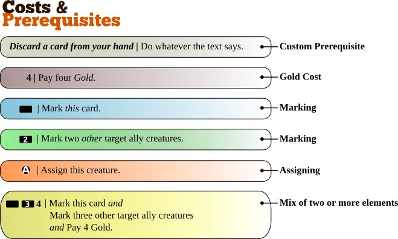

Abilities
=========

Many creatures have special skills and some are able to perform
different kind of actions. There are numerous ways how the creatures can
interact with one and another without engaging in actual physical
combat. These skills are called *abilities*, regardless of what they do,
and if they have any drawbacks or not.

Abilities are not limited to just creatures – Equipment or Magic could
have them as well, granting a creature additional abilities they
wouldn't have without them.

There are three main types of abilities : activated, passive and
triggered.

Passive
-------

A passive ability is one that is always in effect. As soon as the object
with the ability enters play, the ability effect starts, and stops when
the object leaves play.

Example: "All Elvish creatures gets +3 defense" is a passive ability.

Activated
---------

-  In contrast to passive abilities, activated abilities requires the
   activation by the player.
-  To use a card's ability the player must pay the cost required. The
   effect of the ability will not activate before that is done.
-  Only the controller of a card may activate it's abilities. Usually
   that means the player that put the card in play by paying for it.

Payment for activation
~~~~~~~~~~~~~~~~~~~~~~

WTactics uses the above simple system to tell you what the card demands
from you in order to have it's effect activated. What's always common
for all types of costs and prerequisites is that we always reveal the
cost first, followed by a colon separator, and lastly the effect is
written. It looks like this:

``Cost : Effect``

Whatever is on the left side of the colon (:) is the cost or
prerequisites. The text on the right side of the colon is the card's
effect that will activate once you have met the cost/prerequisites
demands.

There are three main groups of costs and prerequisites that are used to
activate abilities: Gold cost, mark (self or other) and custom.

#. The first example (gray) shows us a *custom prerequisite*. Custom
   prerequisites are often text instructions on what you need to do in
   order to activate the ability. If you can't or won't do *exactly* as
   the text says, then the ability is not activated. Keep in mind that
   custom prerequisites can be formulated in any way. They are also more
   rarely used in the game compared to the other types of costs &
   prerequisites.
#. The next example (purple) is straight forward: To activate the
   ability you would need to pay exactly 4 Gold. Not more, not less. If
   you can't afford 4 gold, then you can't activate the ability.
#. The third example (blue) introduces *marking* as something that must
   be done first in order to activate the ability. Whenever you see the
   empty horizontal rectangle it means that in order to activate the
   ability you must be able to *mark* the card. If the card is already
   marked, it can't be marked again, thus, the requirement needed to use
   that ability (you marking the card now when you want to use the
   ability) is not met, and as a result you won't be able to activate
   the ability.
#. Next example (green) also uses marking as a requirement to activate
   the ability. The difference from the previous case is that there is a
   number written inside of the rectangle. This means that you have to
   mark that many *other* creatures in play under your control in order
   to activate the ability.
#. Lastly, we have a complicated example (yellow): It shows us that a
   card can mix any two or more types of costs and prerequisites with
   each other. Although there is no limitation to how they can be mixed,
   mixes are seldom as complicated as in this example.

Triggered
---------

-  A triggered ability is activated if and only if it's trigger takes
   place.
-  Triggered abilities are *not* optional and must always be applied if
   possible.

   -  If a triggered ability's effect can't be applied then nothing
      happens.

-  Example: Discard a non-Black Legion creature every time a skeleton
   comes into play.

   -  If my opponent played that curse on you, and your opponent puts a
      skeleton into play, then you *must* discard a non-Black creature.
      If you have only black creatures however, then it is not possible
      for you to discard a creature, in which case you don't have to do
      anything.

