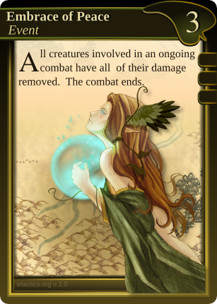

Deck Building
=============

Basics
------

Every deck should contain at least 60 cards, as follows:

-  One Chapter, that is made up of x number of quest cards.
-  The rest may be any mix of Creatures, Events, Enchantments, Equipment
   etc.

Details
-------

Every player composes his/her pile of cards (army deck) of whichever
cards he/she wants, within the limits of the loyalty restrictions
mentioned below. Usually you would want to have prepared a deck and be
done with the building of it *before* you sit down to play a game.

Each card has it's own unique identification number and a version that
precedes it at the bottom right. These are the card number and card
version numbers, and they're very important if you always want to stay
up to date or compete with other players. The card number for a card
wont ever change. Any other info on the card may however become a target
for revision, and, those revision will be reflected by the cards current
version number. Huge changes in card versions are always announced at
the site and well in advance before people are allowed to compete with
them. For casual players this isn't really that important - play the way
you all agree on.

It's allowed to have 4 copies of a card in the deck. A card is only
considered to be an instance of itself if it has the same card number
and/or card name. Two cards are only *equivalent* if they share both
card & version number.

The deck building process is vital for the outcome of the game. In it
the decisions about your play style and possibilities are decided,
directly affecting how well you could fare against your opponent. As the
game proceeds you will draw a given number of cards from the deck almost
every round. The deck is often shuffled and the player seldom knows what
card(s) he/she will draw from it.

The back of all cards in a deck must look *identical*. Having somehow
different backs is considered cheating and prohibited.

Loyalty
-------

|rules card event| The *Loyalty Requirement* determines which
cards you can put in your deck from which factions. Most cards have one
or several *symbols* in place in the top right corner below the faction
logo & gold cost. These symbols indicate the card's faction *Loyalty
Requirement* that has to be *matched or exceeded* by your deck build for
the card to be able to be part of your deck to begin with.

The loyalty requirement is a sum: The symbols are a graphical
representation of a number and must be added together. I.e. three
symbols would mean that the loyalty requirement for that card would be
equal to 3, two symbols mean that the loyalty requirement is 2 and so
on. Each faction has it's own distinct type of loyalty pre-requisites.
In the example to the right we're looking at a Gaian card that has, as
can be seen by the green symbols, a Gaian Loyalty pre-requisite.

To determine which factions and cards you may or may not put in your
deck do the following:

#. Pick out the card with the highest loyalty requirement for each of
   your factions in your army deck. This will result in you picking one
   single card for every faction, and that card having the (shared)
   highest loyalty requirement for it's faction.
#. Add all their loyalty points together.
#. When building a deck that value may never exceed 3.

This means that if you want to use one or more cards of a single faction
that has a maximum loyalty requirement of:

-  Three, then you may only build a deck composed of that faction only.
   No cards from other factions may be included in that deck due to you
   already reaching the loyalty limit of 3.
-  Two, then you may also include cards from *one* additional faction,
   but these cards from that extra faction may only have a maximum
   loyalty requirement of *one*-
-  One, then you may include cards from up to two additional factions,
   but each card

As a result decks in WTactics can only be composed of 1 to 3 factions,
and one could say that there in theory is a primary, secondary and up to
a tertiary faction within a deck.

**Example:**

#. Emma has a Gaian card in her deck with a loyalty requirement of 3.
   This means that Kims deck can never include any cards from other
   factions.
#. Bakunin has a House of Nobles card in his deck with a loyalty
   requirement of 2. He has no other House of Nobles cards with a higher
   loyalty requirement than two. As a result he chooses to add another
   faction to his deck, and he picks cards from the Red Banner to do
   that. However, these cards from his secondary faction in his deck -
   the Red Banner - may only have a loyalty requirement of 1 or less.
   The max requirement of any House of Nobles card in his deck is 2 +
   the max of any Red Banner card in his deck is 1, giving us a total of
   3, resulting in a legal deck build for Bakunin.

Notice: If a card lacks a Loyalty Requirement it may be played freely in
any deck regardless of the above rules or other factions already present
in the deck.

