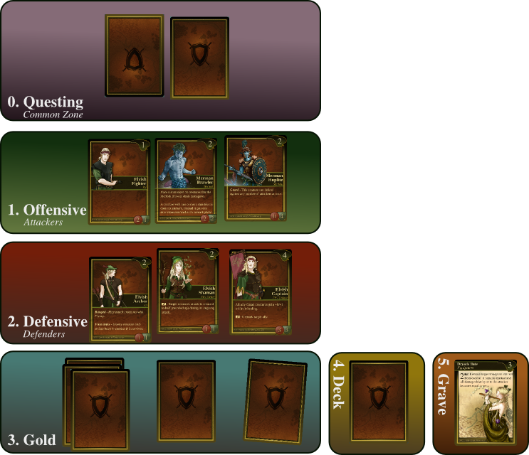
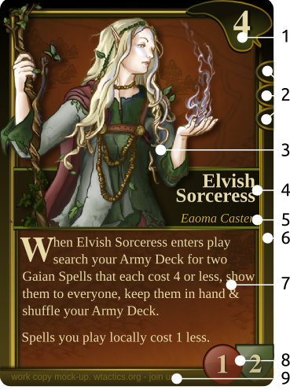

About
=====

WTactics is:

-  An open source project released primarily under GPL2 or later. The
   game is free and libre. Anyone has the liberty to modify, duplicate
   and spread it.
-  Customizable, modular and an ever evolving community driven project.
-  A tactical card game of steel, magic and conquest. Each player is
   commanding forces in an attempt to conquer the opposing domain.

Winning
~~~~~~~

The game is won by being the first to take control of your opponent's
kingdom by lowering his/her influence to zero or be the first one to
achieve a pre-defined amount of Victory Points by completing various
Quests. During the game you'll have to use a combination of skills and
military tactics to ensure that your army prevails on the battlefield.

In the rare case where all remaning players both get 0 influence (or in
theory less points) the player with the highest amount of victory points
is the winner. If that is also equal then the game is considered a draw.
To really find out who has the superior army and mnindset we recommended
you to play best of three games.

Setting up the Game
-------------------

Number of Players
~~~~~~~~~~~~~~~~~

Basic play only requires two players. The game also fully supports
several `multiplayer formats <Quick Rules#Formats_&_Mods>`__ that allow
three or more players to participate. A format is a specific rule set,
which is either a variation of the core rules or almost new rules all
together. They offer new exciting ways to play the game once you're
acquainted with it and it's core rule system.

For the sake of simplicity in the documentation and to flatten the
learning curve we will stick to the most common setup in the world of
customizabel card games - the classical 2 player game, where one player
versus the other, using the rules described in this Original Rules
Concept (ORC).

Materials for Play
~~~~~~~~~~~~~~~~~~

Make sure you have the following materials for each player before you
start a game:

-  2 x accept tokens (beads, coins, whatever as long as they're
   identical and your opponent has different looking ones)
-  20 x tokens
-  Way to keep track of the points

Table Layout
~~~~~~~~~~~~

The playing table is divided into imaginary *areas*. They may be marked
out with ropes or on a custom made playmat, but usually that is not
necessary due to their simple structure. Each area has it's own separate
property and function. Two of the areas are also called *combat zones*,
or just *zones* in short, and it's in those where most of the things
will happen. The below map is an example of how a game can be properly
setup. It shows only the table side of one of the players, except for
the Questing area that is common for both players. Each additional
player is recommended to have a similar *table layout*.

.. raw:: mediawiki

   {{notice|will vary|The ''amount'' of cards in the layout map below and the names of the cards is not relevant: In a normal game of WT the number of cards on the table will vary greatly during the course of the game. Typically there would be fewer cards in the start of the game and more of them as the game progresses.}}

Questing (0)
------------

This area is in the middle of the table. In the center of it each player
places his *Quest pile* faced down, hence there are two quest piles on
the picture. During the game Quest cards will be revealed and offered to
the players.

Offensive Zone (1)
------------------

Creatures that the player wants to be able to *attack* with must be
placed in this *zone*, face up.

Defensive Zone (2)
------------------

Creatures that the player wishes to be able to *defend* with must be
placed in this zone, face up.

Resources (3)
-------------

Gold resources are used as the games primary way to pay for the cards
you wish to put into play.

-  Each turn a player *may* put one of the cards *in hand* face down in
   the resource area.
-  Cards that are placed in the resource area in that fashion become
   *resource cards*.
-  Resource cards produce one gold each when they are marked.

Army Deck (4)
-------------

The player comes to the game with carefully selected cards put in a
pile, face down. That pile is called the army *deck*. This area is where
the army deck resides and from where the player draws new cards every
time it becomes his/her turn.

Grave (5)
---------

The area where *all* the discarded cards go, like for instance dead
creatures and used Event cards. All cards in the grave are face up.

Card span & proximity
---------------------

< PICTURE HERE >

Span
~~~~

Compared with many popular CCG:s, the two zones are best described as
*two different tables*, and WTactics is a game played on *both* of them
at the same time. A card can have an *effect* on something and within
one or more zones. Different effects have different reach. This is
called ''span'.

-  **Local span:** Cards that only have an effect on a local level
   within a zone. A huge majority of the cards have this span unless
   it's clearly stated with text that a card has a reach beyond the
   local span. Very Important: The local span is implicit and *always
   default* unless something else is explicitly stated by the card text.

   -  Example: A creature with the ability *All Merfolk gain the Guard
      ability* means that all Merfolk in the *same zone* as that
      creature get the Guard ability. This would apply in your Offensive
      or Defensive zone, depeneding on where the creature resides, and
      accordingly it would apply in the opponents opposite zone, also
      giving his/hers Merfolk the guard ability.
   -  Effects that target *an x, any x* et.c. do so only within that
      cards local zone, like in the example above, or in the targeted
      zone in the case of effects from Event cards.

-  **Global span:** Cards that affect *both* the offensive and defensive
   zones.

   -  Example: If a creature has the ability *Merfolk in all zones gain
      the Guard ability* it would grant the Guard ability to Merfolk
      everywhere on the table, no matter which player that controlled
      them or if they are in the Offensive or Defensive zones.

Proximity
~~~~~~~~~

While the span tells us *how far* reaching something is, the proximity
tells us how we are ordered in a spatial aspect. Picture a Wizard
casting some dark magic: Her span may be far reaching, affecting
somebody in the other end of the world, but her proximity is the room
where she is actually performing the magic, with all the objects in it
like books, scrolls and candles.

Local Proximity
---------------

-  All cards except for Magic & Events stay in play until they're
   somehow removed. Such cards, also known as *permanents*, always
   reside in a zone while in play. Whatever is in the same zone as a
   card in play is considered to be *local* to that card.
-  If a creature moves into another zone it's new zone is considered to
   be the new *local* zone of that creature.

The offensive and defensive zones are two remote places in room that are
only connected with the opponents counterpart. What comes into play into
the offensive can't affect what goes on in the same players defensive
and vice versa. Cards are *hindered* from interaction *across* the zones
*while controlled by the same player*. Each players defensive is however
connected and may interact with each other enemy players offensive, and
each players offensive may interact with every other enemy players
defensive. In short, opposite enemy zones are considered to be one and
the same.

Non-local Proximity
-------------------

All cards that don't share the same zone as a card are not local to that
card.

Card States
~~~~~~~~~~~

In Play
-------

When a card is legally moved from hand, deck, quest pile or grave onto
the game table it is *entering play*, and if nothing hinders it the card
is then *in play*.

All cards that have been paid for and that also meet other prerequisites
such as for exampel loyalty points, if any, are considered to be *in
play*. Typically that would be all permanents that are on the table,
like your creatures, equipment and enchantment. Events, effects of
abilities and Magic are technically speaking also *in play* for a very
short moment: They enter play, are *in play*, resolve and then become
discarded into the grave - leaving play.

Not in Play
-----------

-  A card that is not in the *in play* state is considered to be *not in
   play*.
-  All the cards in a players hand, army deck, quest piles and grave are
   good examples of cards that are *not in play* until their owner pays
   for them and puts them in play.
-  Card that are not in play lack a span of their effects and also lack
   promixity since they are not yet an active part of the game. Once
   played they will have a span and in some cases also proximity.

Removed from Game
-----------------

A card that is *removed from game* is not considered to have the *in
play* state or the *not in play* state: A card that has been removed
from the game ceases to exist for all intents and purposes for the
remaining duration of the game. *Removed from game* cards are not placed
in the grave. They are be placed in a pile more distant from the game
since there will be no interaction with them while playing.

There is a huge difference between *cards not in play* and *cards
removed from the game*: Cards not in play are still a part of the game
and might come into play at some point. Cards in hand or in the deck or
even in the grave are an example of cards not in play. Cards that have
been removed from the game may *never* in any way become part of it
again during that game.

Card Layout
-----------

#. **Cost & Faction Logo:** If the card has a gold cost, it will be
   shown there. The cost is the amount of gold you will have to spend to
   be able to play the card. The Faction logo (in this case a leaf for
   the Gaian faction) shows which faction the card belongs to.
#. **Loyalty:** Every deck build gives the player a Loyalty Point
   associated with his faction(s). The Loyalty Requirement shown on a
   card must be equal to or lower than what is given by your deck build.
   In this example the Elvish Sorceress requires a Gaian loyalty of 3,
   as indicated by the three Gaian Loyalty icons.
#. **Card Art:** The illustration has *no impact whatsoever* on the
   rules of the game and how things are played out. It's mainly of an
   aesthetical value and also helps the players to quickly identify and
   remember cards in addition to give the game a nice theme and setting.
#. **Card name / types:** Every card has it's unique name. All cards
   that have the same *identification number* are considered to be
   copies of one and the same card. That does however not necessarily
   make them *identical* while they are in play since they can be under
   the influence of different modifiers and effects wile being in play.
#. **Additional Card Types:** This line contains the *types(s)* of the
   card and possible additional *subtypes*. Each card type is governed
   by specific rules found in this document, while subtypes are usually
   associated with rules found on other cards.
#. **Coloured border:** The border around a card reveals what faction it
   belongs to. Our Elvish Sorceress has a green surrounding border,
   revealing - together with the faction logo in 1 - that this is indeed
   a Gaian card.
#. **Card Text:** Additional abilities of the card are written in this
   area.
#. **Combat Statistics:** If the card represents a creature, it's combat
   abilities will be shown here. The first value is it's attack (ATK),
   it's second value is it's defence (DEF).
#. **Footer:** Contains info about the cards collectors number and
   version, rarity and our projects website.
